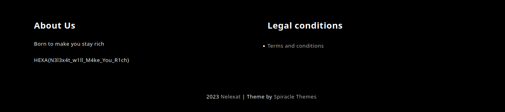
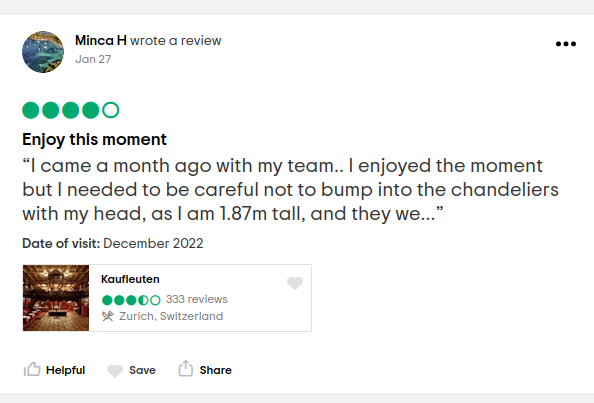

# <u>The Lawyer</u> :

**<u>Resume</u> :**
In this CTF, we investigate "Nelexat" a Swiss legal company created especially for this event. For that, several points allow us to find the totality of their actions towards "Lucilhe", their customer.

# <u>The law firm</u> :

## <u>Statement</u>

-  We understand that "Nelexat" is a Swiss law firm defending "Lucilhe". We also note that they have a website.
-  The Swiss extensions of the site are ".ch" so we find the link: "http://www.nelexat.ch/"
-  We just have to read the flag in the footer of the site

 **FLAG : HEXA{N3l3x4t_w1ll_M4ke_You_R1ch}**

# <u>Trustwhorty</u> :

## <u>Statement</u>

**[Unlocked after completing "The Law Firm"]**

-  In this situation, the title puts us in the way of "confidence". Looking at the URL, we see that the connection is not secure. Then we just have to look at the certificate information to find the email "mastermind_mastermind@proton.me"

**FLAG : HEXA{mastermind_mastermind@proton.me}**

# <u>The lawyer</u> :

## <u>Statement</u>

**[Unlocked after completing "The Law Firm"]**

-  Here we need to search in which city studied the owner of the company. Nothing more simple, we search a little on their website. A name is given in the legal conditions: "Lian Nussbaumer"

-  By searching his name on Linkedin, a profile exists with this name: https://www.linkedin.com/in/lian-nussbaumer-92b89b253/

-  He is the owner of the company and we find that he studied in the city of **"Neuchâtel"**.

 **FLAG : HEXA{Neuchatel}**

# <u>Experts</u> :

## <u>Statement</u>

**[Unlocked after completing "The Lawyer"]**

- For this one, we need to look for information around the Nelexat company's customer. To start, we find an API host on an external IP hidden in their tips page:

- FastAPI proposes an endpoint "/docs/" which will be useful for the following.
We understand that we have to search for the client's last name. 
At the very beginning of the CTF, the organizers made a voice explaining that it happened the previous year, which allowed us to have the last name of Lucilhe.

- Coupling all this information, we test the endpoint "http://217.182.69.14:8000/cases/clients?name=dumarquais" and we find the flag !

**FLAG : HEXA{s3cure_y0ur_d4mn_4p1}**

# <u>Alias</u> :

## <u>Statement</u>

**[Unlocked after completing "The Lawyer"]**

-  For this challenge, we must find his account on a trading platform. While viewing Lian's posts, we find a rather interesting post for the next part:

 
-  We now have his nickname: **"NelexLian"**.
-  Searching on Etoro (known trading platform) we find a user "NelexLian" with the flag on his profile!

**FLAG : HEXA{nelexlian_is_rich}**

# <u>Herbaceous</u> :

## <u>Statement</u>

**[Unlocked after completing "Trustwhorty"]**

- Using the email address "mastermind_mastermind@proton.me" on https://epieos.com, we find a calendar linked to a google account.

- Reading the event "meeting" we find a link in ".onion". After	 an express copy and paste on Tor (and a taped camera because TheBaboon likes to see you smile), we just have to inspect the page to find the flag! We will take the wallet address information used in the following challenges.

**FLAG : HEXA{N3l3x4t_is_L1nk3d_to_M4stermind}**

# <u>Decentralised</u> :

## <u>Statement</u>

**[Unlocked after completing "Herbaceous"]**

- Using the wallet address found earlier, we search on "https://blockchain.com" to find the transaction history. 

- Looking at the 1st one, we have data transferred with "636f6e74616374206d61696c203a20747375796f36334070726f746f6e2e6d650d0a636f6465206e616d65203a204272756973656420526f677565"

- decoded in hexadecimal, we find the name of the mission and an email address :D

**FLAG : HEXA{Bruised_Rogue}**

# <u>Good time</u> :

## <u>Statement</u>

**[Unlocked after completing "Herbaceous"]**

- For this challenge, let's use the same methodology as Herbaceous: the meeting.
 If you are connected to a Google account and look at the calendar, you will see the mails of the concerned persons.

- Knowing this, we can see two mails. Epieos not giving anything, we look for the nicknames on "https://whatsmyname.app" 

- and we find a Tripadvisor giving the location of the meeting :p

**FLAG : HEXA{Kaufleuten}**

# <u>Kanagawa</u> :

## <u>Statement</u>

**[Unlocked after completing "Decentralised"]**

- With the wallet address we found in "Herbaceous" we just had to look for a way to receive money other than through simple transactions.

- Opensea is a way to sell NFTs which seemed most likely. Typing in the address, we came across an account named  (Mind_master) selling an NFT. 

- Searching in the description, we find the flag :)

**FLAG : HEXA{n1ce_L0g0_br0}**
